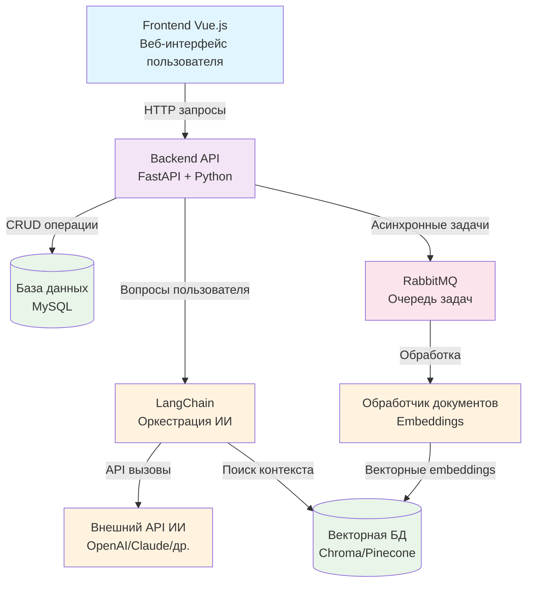
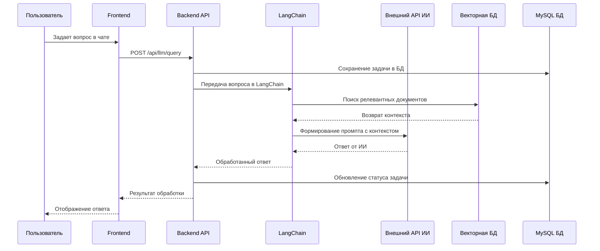
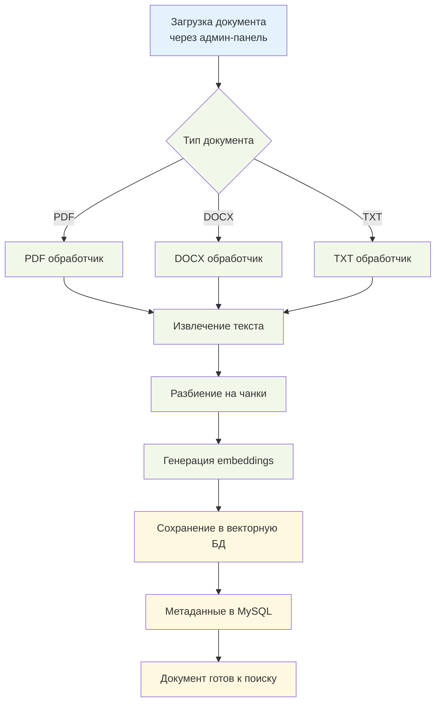

# Блок-схема интеграции с внешним API ИИ

## Общая архитектура системы



## Детальный процесс обработки запроса пользователя



## Процесс загрузки и обработки документов



## Компоненты системы и их взаимодействие

### 1. Frontend (Vue.js)
- **Роль**: Пользовательский интерфейс
- **Взаимодействие**: Отправляет HTTP запросы к Backend API
- **Основные функции**: Чат с ИИ, загрузка документов, управление контентом

### 2. Backend API (FastAPI + Python)
- **Роль**: Центральный сервер приложения
- **Взаимодействие**: 
  - Принимает запросы от Frontend
  - Управляет базой данных MySQL
  - Оркестрирует работу с LangChain
  - Обрабатывает файлы и документы

### 3. LangChain (Python библиотека)
- **Роль**: Оркестрация работы с ИИ
- **Взаимодействие**:
  - Формирует промпты для внешнего API ИИ
  - Управляет поиском в векторной базе данных
  - Обрабатывает контекст и ответы
  - Интегрируется с различными провайдерами ИИ

### 4. Внешний API ИИ
- **Роль**: Генерация ответов на основе промптов
- **Варианты**: OpenAI GPT, Anthropic Claude, Google Gemini, др.
- **Взаимодействие**: Получает структурированные запросы от LangChain

### 5. Векторная база данных
- **Роль**: Хранение и поиск семантических представлений документов
- **Варианты**: Chroma, Pinecone, Weaviate, Qdrant
- **Взаимодействие**: Предоставляет релевантный контекст для запросов

### 6. MySQL база данных
- **Роль**: Хранение структурированных данных
- **Содержит**: Пользователи, документы, метаданные, задачи
- **Взаимодействие**: CRUD операции через SQLAlchemy

### 7. RabbitMQ (опционально)
- **Роль**: Очередь для асинхронных задач
- **Применение**: Обработка больших документов, фоновые задачи
- **Взаимодействие**: Координация между компонентами

## Преимущества архитектуры с внешним API

1. **Масштабируемость**: Легко переключаться между провайдерами ИИ
2. **Гибкость**: Возможность использования разных моделей для разных задач
3. **Производительность**: Не требует локальных вычислительных ресурсов
4. **Обновляемость**: Автоматические обновления моделей от провайдеров
5. **Интеграция**: Простая интеграция с существующими системами

## Конфигурация для разных провайдеров

```python
# Пример конфигурации в settings.py
AI_PROVIDERS = {
    "openai": {
        "api_key": "sk-...",
        "model": "gpt-4",
        "base_url": "https://api.openai.com/v1"
    },
    "anthropic": {
        "api_key": "sk-ant-...",
        "model": "claude-3-sonnet",
        "base_url": "https://api.anthropic.com"
    },
    "google": {
        "api_key": "...",
        "model": "gemini-pro",
        "base_url": "https://generativelanguage.googleapis.com"
    }
}
```

## Безопасность и мониторинг

- **API ключи**: Безопасное хранение в переменных окружения
- **Rate limiting**: Ограничение запросов к внешним API
- **Логирование**: Мониторинг использования и ошибок
- **Fallback**: Резервные провайдеры при сбоях
- **Кэширование**: Сохранение частых запросов 